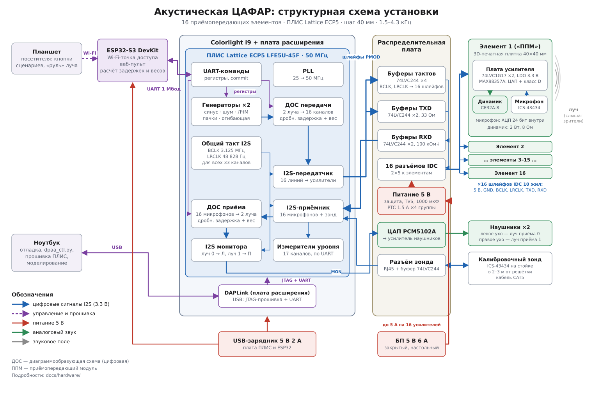
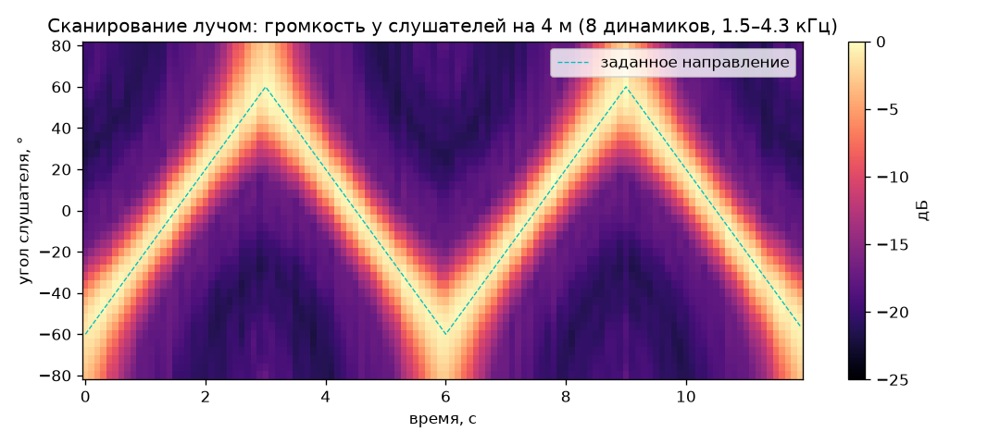

# DPAA — ЦАФАР, которую можно услышать

Проект демонстрации принципов **цифровой активной фазированной антенной решётки
(ЦАФАР)** в акустическом диапазоне: вместо антенн — динамики и микрофоны, вместо
СВЧ — звук 1.5–4 кГц, вместо осциллографа — уши зрителей.

Звук в ~875 000 раз медленнее радиоволн, поэтому решётка из восьми динамиков
с шагом 4 см геометрически эквивалентна решётке S-диапазона, а обычная
многоканальная звуковая карта оцифровывает сигнал прямо на «несущей» — то, о чём
мечтают разработчики настоящих ЦАФАР.

Подробная концепция, расчёты, сценарии и варианты железа: **[docs/concept.md](docs/concept.md)**.

**Железо** (16 элементов, ПЛИС ECP5 на модуле Colorlight i9, ≈ 750 $, с резервом ≈ 860 $ из 1000 $):
[архитектура](docs/hardware/architecture.md) · [спецификация и бюджет](docs/hardware/bom.md) ·
[схемы плат](docs/hardware/schematics.md) · [распиновка](docs/hardware/pinout.md) ·
[схема соединений](docs/hardware/wiring.md) · [элемент: динамик + микрофон, 3D-модель](docs/hardware/mechanics.md) ·
[прошивка ПЛИС](gateware/README.md)





## Что уже есть

* `dpaa/` — небольшая библиотека моделирования:
  * `geometry.py` — решётки (линейные, плоские), направления, задержки фазирования;
  * `signals.py` — дробные задержки (БПФ и КИХ для реального времени), фазовращатель,
    тестовые сигналы;
  * `patterns.py` — диаграммы направленности, весовые окна, «косоглазие» луча, квантование;
  * `propagation.py` — распространение звука в свободном поле;
  * `transmit.py` — формирование лучей на передачу, многолучевость, сканирование, запись WAV;
  * `beamforming.py` — приём: задержка-сумма, MVDR (Кейпон), «акустическая камера».
* `scripts/`:
  * `design_calc.py` — таблицы параметров решётки;
  * `plot_patterns.py` — иллюстрации в `docs/img/`;
  * `make_tx_demo.py` — 8-канальные WAV для реальной решётки динамиков и
    **моно-WAV «виртуальных слушателей»** — можно послушать эффект в наушниках уже сейчас;
  * `demo_rx_sim.py` — приём двумя лучами и адаптивное подавление помехи.
* `dpaa/hw.py` — аппаратная модель: карта регистров, протокол UART, фиксированная точка,
  эталонная модель ядра ПЛИС (RTL сверяется с ней бит в бит).
* `gateware/` — прошивка ПЛИС на Verilog: I2S на 16 усилителей и 17 микрофонов,
  генераторы, цифровое диаграммообразование на передачу (2 луча) и приём (2 луча).
* `tools/dpaa_ctl.py` — управление с ноутбука: луч, сканирование, два луча, фокус,
  поэлементный тест, лучи приёма в наушники, уровни микрофонов.
* `tests/` — проверки физики и алгоритмов и RTL-тесты ПЛИС (`pytest`, нужен Icarus Verilog).

## Быстрый старт

```bash
pip install -r requirements.txt
python -m pytest -q                 # тесты
python scripts/design_calc.py       # расчёт параметров
python scripts/plot_patterns.py     # графики -> docs/img/
python scripts/make_tx_demo.py      # WAV -> out/tx/
python scripts/demo_rx_sim.py       # WAV -> out/rx/
```

Послушать без железа: `out/tx/listen_two_beams_-35deg.wav` и `..._+35deg.wav` —
что слышат два человека, стоящие по разные стороны от решётки, воспроизводящей
два луча одновременно; `out/tx/listen_prism_phase_*` — «звуковая призма»;
`out/rx/mic1.wav` vs `out/rx/mvdr_target.wav` — подавление помехи на приёме.

## Соглашения

Решётка лежит вдоль оси x и излучает вдоль +y. Угол отсчитывается от нормали,
положительные углы — вправо, если стоять за решёткой и смотреть в направлении
излучения. Канал 1 многоканального WAV — крайний левый элемент.
