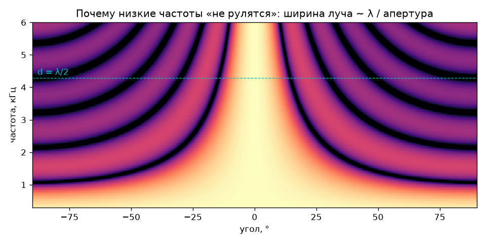
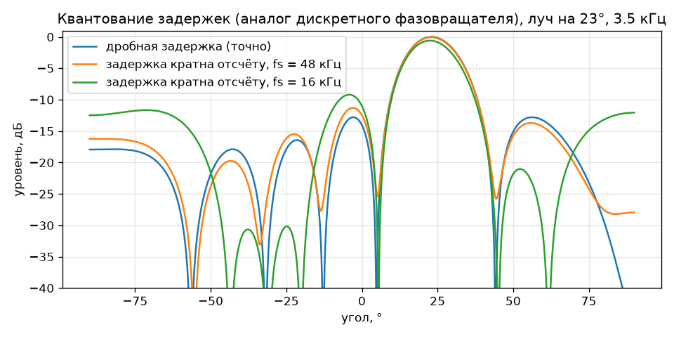
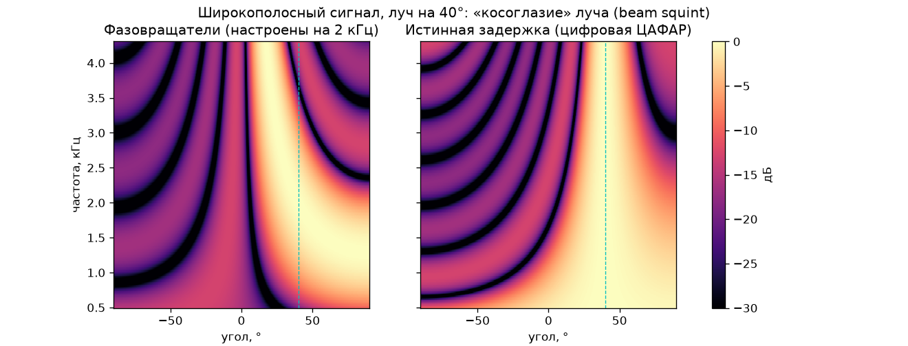
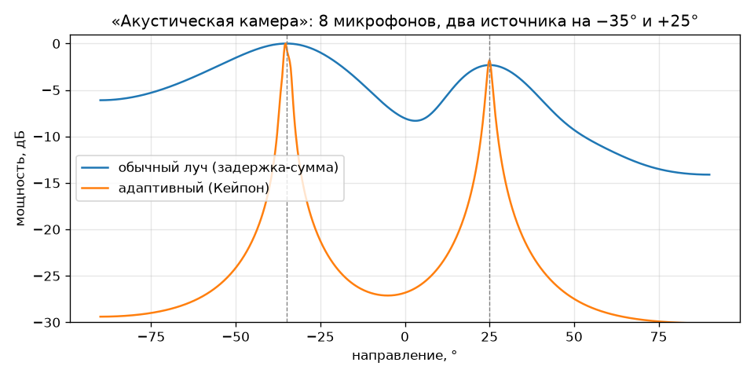

# Акустическая ЦАФАР: концепция

> Цель — показать принципы работы цифровой активной фазированной антенной решётки
> (ЦАФАР) так, чтобы их мог **услышать и увидеть** любой человек без радиотехнического
> образования и без измерительной аппаратуры.

## 1. Почему звук — идеальный «тренажёр» для ЦАФАР

**Физика одна и та же.** Интерференция, фазирование, дифракционные лепестки, ближняя и
дальняя зоны, ширина луча ~ λ/D — всё это свойства волнового уравнения, а не радио.
Важна не частота, а **длина волны относительно размеров решётки**.

**Та же длина волны — в миллион раз медленнее.** Звук распространяется примерно в
875 000 раз медленнее радиоволн, поэтому решётка из динамиков с шагом в несколько
сантиметров «работает» на частотах в единицы килогерц:

| Диапазон РЛС | f радио | λ | f звука с той же λ |
|---|---|---|---|
| L | 1.3 ГГц | 23.1 см | 1486 Гц |
| S | 3 ГГц | 10.0 см | 3430 Гц |
| C | 5.5 ГГц | 5.5 см | 6288 Гц |
| X | 10 ГГц | 3.0 см | 11433 Гц |

То есть акустическая решётка на 3–4 кГц — это геометрически точная модель решётки
S-диапазона, только «замедленная».

**Главный подарок: прямая оцифровка на несущей.** В настоящей ЦАФАР самое дорогое и
сложное — приёмопередающий модуль (ППМ) и АЦП/ЦАП в каждом канале, по возможности
ближе к антенне. В акустике обычный звуковой АЦП/ЦАП на 48 кГц оцифровывает сигнал
**прямо на несущей**, без гетеродинов и квадратурных преобразователей. Многоканальная
звуковая карта — это готовая «цифровая часть» ЦАФАР за копейки. Всё диаграммообразование
делается в компьютере, как и в настоящей ЦАФАР.

**Детектор — ухо, сканер — ноги.** Зритель, проходя вдоль решётки, буквально
«снимает» диаграмму направленности своими ушами: где громко — там луч.

### Соответствие понятий

| ЦАФАР (радио) | Акустическая модель |
|---|---|
| Излучающий элемент | Небольшой динамик (Ø 30–40 мм) |
| Приёмный элемент | Микрофон (электретный или цифровой MEMS) |
| ППМ (приёмопередающий модуль) | Канал: ЦАП → усилитель → динамик; микрофон → предусилитель → АЦП |
| Фазовращатель / линия задержки | Цифровая дробная задержка (КИХ-фильтр или БПФ) |
| Цифровое диаграммообразование (ДОС) | Python/C-код: задержка-сумма, MVDR |
| Опорный генератор, синхронизация | Общий тактовый генератор звуковой карты |
| Калибровка каналов | Измерение АЧХ/ФЧХ каждого канала опорным микрофоном |
| Зондирующий сигнал (ЛЧМ) | Звуковой «чирп» 2 → 4 кГц |
| Эхо от цели, дальность | Отражение от стены / человека / щита |
| Доплер | Движение руки: 1 м/с на 3 кГц даёт сдвиг ≈ 17.5 Гц |

## 2. Базовая конфигурация и расчёт

Предлагаемая стартовая решётка: **8 элементов, шаг d = 4 см, апертура 32 см**
(вариант развития — 16 элементов, 64 см). Шаг 4 см выбран из двух соображений: он
допускает сканирование во всём секторе ±90° без дифракционных лепестков до
c/(2d) ≈ 4.3 кГц, и в него ещё помещаются доступные малогабаритные динамики.

Условие отсутствия дифракционных лепестков: `f < c / (d · (1 + |sin θ_max|))`.
Для d = 4 см: 8.6 кГц (только нормаль), 5.7 кГц (±30°), 4.6 кГц (±60°).

Расчёт — `python scripts/design_calc.py`:

**N = 8, d = 4 см**

| f, Гц | λ, см | ширина луча −3 дБ (нормаль) | при 30° | граница дальней зоны 2D²/λ, м |
|---|---|---|---|---|
| 500 | 68.6 | 146° | 117° | 0.30 |
| 1000 | 34.3 | 57° | 77° | 0.60 |
| 2000 | 17.2 | 28° | 33° | 1.19 |
| 3000 | 11.4 | 18° | 21° | 1.79 |
| 4000 | 8.6 | 14° | 16° | 2.39 |

**N = 16, d = 4 см**

| f, Гц | ширина луча (нормаль) | при 30° | 2D²/λ, м |
|---|---|---|---|
| 1000 | 28° | 32° | 2.4 |
| 2000 | 14° | 16° | 4.8 |
| 4000 | 7° | 8° | 9.6 |

Вывод: **рабочий диапазон демонстраций — примерно 1.5–4.3 кГц**. Ниже ~1 кГц
решётка из 8 элементов практически ненаправленная (λ больше апертуры) — это не
недостаток, а тоже отличная иллюстрация: «почему у РЛС метрового диапазона
огромные антенны».

### Квантование задержки

Если задержки делать сдвигом на целое число отсчётов, это аналог дискретного
фазовращателя:

| fs, кГц | шаг задержки, мкс | путь звука за шаг, мм | макс. фазовая ошибка на 4 кГц | ≈ разрядность фазовращателя |
|---|---|---|---|---|
| 16 | 62.5 | 21.4 | ±45° | 2 бита |
| 48 | 20.8 | 7.1 | ±15° | 3.6 бита |
| 96 | 10.4 | 3.6 | ±8° | 4.6 бита |

Поэтому используем **дробные задержки** (КИХ-фильтр sinc или БПФ) — точность
ограничена только калибровкой. Сравнение — на рисунке ниже.

## 3. Демонстрационные сценарии

Каждый сценарий показывает один принцип ЦАФАР. Все они уже смоделированы в
`scripts/` — для передающих есть 8-канальные WAV для реальной решётки и
«виртуальные слушатели» (моно-WAV, что слышит человек под данным углом).

| # | Сценарий | Что слышит/видит зритель | Принцип ЦАФАР |
|---|---|---|---|
| 1 | **Бегущий луч** (`sweep_8ch.wav`) | Звук «прокатывается» по залу слева направо и обратно, хотя ничего не движется | Электронное сканирование без механики |
| 2 | **Два луча — два сигнала** (`two_beams_8ch.wav`) | Левая половина зала слышит мелодию, правая — «чирпы» | Многолучевость: несколько независимых лучей одновременно — только в цифровой решётке |
| 3 | **Звуковая призма** (`prism_phase_8ch.wav` vs `prism_ttd_8ch.wav`) | С фазовращателями высота шума меняется при ходьбе по залу; с истинными задержками — нет | Beam squint: фазовращатель ≠ линия задержки для широкополосного сигнала |
| 4 | **Дифракционные лепестки** | Повышаем частоту (или выключаем каждый второй динамик) — появляется второй «призрачный» луч | Условие d ≤ λ/2 |
| 5 | **Амплитудное распределение** | Сбоку от луча становится тише, сам луч чуть шире | Боковые лепестки и окна Тейлора/Чебышёва |
| 6 | **Акустический прожектор** (`focus_8ch.wav`) | Звук собирается в точку, где стоит зритель | Фокусировка в ближней зоне |
| 7 | **Акустическая камера** (приём) | На экране «горят» пятна там, где кто-то говорит | Пространственный спектр, многолучевой приём |
| 8 | **Направленное ухо** (приём) | В наушниках слышно только того, куда «навели» луч мышкой | Приёмное ДОС, выигрыш решётки |
| 9 | **Подавление помехи** (приём) | Громкий «шумовой» динамик исчезает, голос остаётся | Адаптивное ДОС (MVDR/Кейпон), нуль ДН на помеху |
| 10 | **Акустический радар** | ЛЧМ-«чирпы», на экране — отметки от людей/щитов по дальности и азимуту, доплер от движения руки | Полный цикл РЛС: излучение, приём, сжатие, ДОС |
| 11 | **Отказ элементов, калибровка** | Выключаем/«расстраиваем» каналы — луч разваливается; после калибровки собирается | Роль калибровки и деградация ФАР |

### Что уже показывает моделирование

* Сканирование (сценарий 1): луч следует заданному направлению, контраст ~20 дБ.
  
* Два луча (сценарий 2): слушатель на −35° слышит мелодию на ~26 дБ громче чирпов,
  слушатель на +35° — чирпы на ~15 дБ громче мелодии.
* Призма (сценарий 3): при фазовом управлении «центр тяжести» спектра у слушателя
  смещается с 3.2 кГц (20°) до 1.6 кГц (70°) — на слух это отчётливое изменение тембра.
  
* Приём (сценарии 7–9), 2 источника на 5 м, 8 микрофонов:

  | выход | отношение цель/помеха |
  |---|---|
  | один микрофон | +3.7 дБ |
  | луч «задержка-сумма» на цель | +21 дБ |
  | адаптивный луч MVDR на цель | +64 дБ (идеальное свободное поле!) |

  В реальной комнате с отражениями и неидеальной калибровкой ожидаемо на порядок
  скромнее (ориентир — 10–25 дБ), но эффект всё равно отчётливо слышен.
  

Поучительная деталь, найденная при моделировании: если обучать MVDR на смеси, где
присутствует сам полезный сигнал, при малейшем рассогласовании модели он начинает
**подавлять цель** («самоподавление»). Поэтому ковариация оценивается по участку, где
есть только помеха, — ровно так же, как обучающая выборка в РЛС.

## 4. Аппаратные варианты

Ключевое требование к «цифровой части»: **все каналы от одного тактового генератора**.
Несколько независимых USB-звуковых карт использовать нельзя — их часы расходятся,
и луч «поплывёт».

### Уровень 1 — «Слышно всем» (только передача, минимальный бюджет)
* ПК/ноутбук + USB-звуковая карта 7.1 (8 аналоговых выходов с одного кодека).
  Проверить: все 8 каналов независимы, ОС не делает upmix/bass management,
  канал LFE не фильтруется.
* 8 малогабаритных широкополосных динамиков Ø 30–40 мм на общей панели с шагом 4 см.
* 4 стереоусилителя класса D малой мощности (или один многоканальный).
* ПО — уже есть: `make_tx_demo.py` генерирует 8-канальные WAV.

### Уровень 2 — «Акустическая камера» (приём)
* Готовый USB-массив микрофонов (например, miniDSP UMA-16: 16 MEMS 4×4, шаг ≈ 4 см —
  уточнить характеристики) — сразу даёт 2D-камеру.
* Или своими руками: цифровые MEMS-микрофоны с I²S/TDM-выходом (INMP441, ICS-43434,
  ICS-52000 с TDM). Такой микрофон — уже **цифровой элемент со встроенным АЦП**,
  прямой аналог элемента ЦАФАР. Чтение 8–16 микрофонов с общим тактированием —
  RP2040 (PIO), ESP32-S3, STM32 или ПЛИС.
* Экран с тепловой картой поверх видео с веб-камеры — самый зрелищный вариант.

### Уровень 3 — «Полная ЦАФАР» (приём + передача в каждом элементе)
* Аудиоинтерфейс класса 8 вход / 8 выход (студийные интерфейсы с 8 микрофонными
  предусилителями) — каждый канал = ППМ: динамик + микрофон.
* Встраиваемый вариант: кодек CS42448 (6 АЦП / 8 ЦАП, TDM) с Teensy 4.x или
  Raspberry Pi — автономный экспонат без ПК.
* Открывает сценарии 10–11: акустический радар, калибровка по внутреннему тракту.

## 5. Подводные камни (и как с ними жить)

1. **Реверберация.** В комнате отражения создают «ложные» источники. Решения:
   большой зал, звукопоглощающие панели за и вокруг решётки, короткие импульсные
   сигналы, демонстрация на улице. Для радарного режима — стробирование по дальности.
2. **Низкие частоты не управляются.** Контент для демонстраций — 1.5–4.3 кГц
   (мелодии в 6–7 октаве, полосовой шум, чирпы). Для речи нужна решётка побольше
   или вложенные решётки (разные шаги для разных полос — как в многодиапазонных ФАР).
3. **Разброс элементов.** Динамики одной партии отличаются по чувствительности и фазе
   на единицы дБ и десятки градусов → обязательна калибровка опорным микрофоном
   (измерить импульсную характеристику каждого канала, выровнять КИХ-фильтром).
4. **Собственная направленность и взаимное влияние динамиков** — аналог ДН элемента
   и взаимной связи в ФАР. Нужна общая жёсткая панель (экран).
5. **Задержка ОС в реальном времени.** Первые демо — готовые WAV; интерактив — через
   ASIO/JACK/CoreAudio с малым буфером или на микроконтроллере.
6. **Громкость и безопасность.** Высокие частоты 3–4 кГц — область максимальной
   чувствительности слуха: держать уровень умеренным (< 80 дБА у зрителей).
7. **Температура.** Скорость звука меняется на ~0.6 м/с на °C — для точной
   фокусировки учитывать (аналог учёта условий распространения).

## 6. Дорожная карта

| Этап | Результат | Статус |
|---|---|---|
| 0. Моделирование | Библиотека `dpaa`, графики, WAV для решётки и «виртуальных слушателей», тесты | ✅ начато (этот репозиторий) |
| 1. Передающая решётка 8 эл. | Живые сценарии 1–6 | ⏳ выбор железа |
| 2. Приёмная решётка | Акустическая камера, «направленное ухо», MVDR (7–9) | ⏳ |
| 3. Калибровка | Автоматическое измерение и выравнивание каналов (11) | ⏳ |
| 4. Акустический радар | ЛЧМ, сжатие импульса, дальность-азимут, доплер (10) | ⏳ |
| 5. Интерактивный экспонат | Реальное время, управление с планшета/джойстика, визуализация | ⏳ |

Параметры радарного режима (оценка для полосы чирпа 2–4 кГц): разрешение по
дальности c/(2B) ≈ 8.6 см; при периоде повторения 100 мс однозначная дальность
≈ 17 м; доплер от движения руки 1 м/с на 3 кГц ≈ 17.5 Гц — различим при
длительности пачки ≥ 0.1 с.

## 7. Открытые вопросы

* Для какой аудитории и формата: лекция, школа, музей/выставка, конференция?
* Что показать первым: передачу (слышат все в зале) или приём (экран + наушники)?
* Бюджет и предпочтительная платформа: ПК + звуковая карта или автономная встраиваемая
  система?
* Помещение: есть ли большой зал или хотя бы возможность демонстрации на улице?
