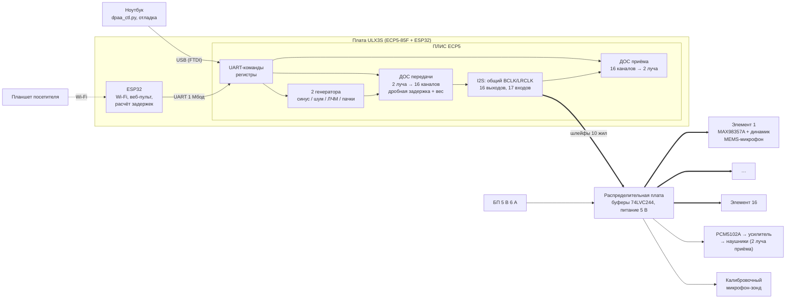

# Аппаратная архитектура: 16-элементная акустическая ЦАФАР на ПЛИС

## Исходные требования

| Требование | Решение |
|---|---|
| Школьная конференция, музей кафедры | Автономный экспонат: включил в розетку — работает; управление с планшета по Wi‑Fi |
| И приём, и передача (в основном передача) | Каждый элемент = динамик + микрофон («ППМ»), 16 элементов |
| Бюджет ≤ 1000 $ | ≈ 830 $ с запасом 15 % (см. [bom.md](bom.md)) |
| 100 % МК/ПЛИС, ноутбук только для управления и отладки | ПЛИС ECP5 (плата ULX3S) + встроенный в плату ESP32; ноутбук по USB |

## Главные решения

1. **16 элементов, шаг 40 мм, апертура 64 см.** Ширина луча ≈ 7° на 4 кГц и ≈ 14° на
   2 кГц; сканирование ±90° без дифракционных лепестков до 4.3 кГц. 16 — оптимум
   для ULX3S по числу выводов (19 выходов + 17 входов).
2. **Цифровой элемент.** Усилитель MAX98357A принимает I2S и сам содержит ЦАП и
   усилитель класса D; MEMS-микрофон (INMP441 / ICS-43434) содержит АЦП и выдаёт I2S.
   Граница «аналог/цифра» проходит **внутри элемента** — ровно как в настоящей ЦАФАР.
   Между распределительной платой и элементами идут только цифровые сигналы
   3.3 В, аналоговых проводов нет, помехи на шлейфах не страшны.
3. **Когерентность «по построению».** Все 32 преобразователя тактируются одними
   BCLK = 3.125 МГц и LRCLK = 48 828 Гц от ПЛИС. Задержки между каналами создаются
   только цифровой обработкой.
4. **Вся обработка сигналов — в ПЛИС** (детерминированно, отсчёт в отсчёт):
   генераторы сигналов, формирование лучей на передачу и приём, измерители уровня.
   ESP32 на той же плате — «пульт»: Wi‑Fi-точка доступа, веб-страница для планшета,
   расчёт таблиц задержек (тригонометрия) и запись их в ПЛИС.
5. **Открытые инструменты.** Yosys + nextpnr + ecppack — бесплатно, без лицензий,
   работает на любом ноутбуке. Проект уже синтезирован и разведён (см. ниже).

## Структурная схема

## Тракт сигнала и численные параметры

| Параметр | Значение |
|---|---|
| Системная частота ПЛИС | 50 МГц (PLL из 25 МГц) |
| Частота дискретизации | 50 МГц / 1024 = **48 828.125 Гц** |
| BCLK / кадр I2S | 3.125 МГц, 64 такта (2 × 32 бита), данные 24 бита |
| Разрешение задержки | 1/32 отсчёта = 0.64 мкс = 0.22 мм пути звука (≈ 0.7° фазы на 3 кГц) |
| Фильтр дробной задержки | 8 отводов, 32 фазы, ошибка ≤ −78 дБ до 5.9 кГц |
| Диапазон задержек | 3 … 248 отсчётов (до 5 мс, 1.7 м пути — хватает и для фокусировки) |
| Разрядность | отсчёты и коэффициенты 18 бит (умножители 18×18), выход 24 бита |
| Лучи на передачу | 2 независимых (у каждого свой генератор и своя таблица задержек/весов) |
| Лучи на приём | 2 (левое и правое ухо наушников) |
| Смена луча | атомарно, по команде commit, на границе кадра — без щелчков |
| Задержка обработки | 2–3 отсчёта (≈ 50 мкс) |
| Управление | UART 1 Мбод, 7-байтовые кадры с контрольной суммой, от ноутбука и от ESP32 |

Ресурсы ПЛИС (LFE5U-85F, `make check`): **15 000 LUT (17 %), 7 500 триггеров (9 %),
16 умножителей из 156, 9 блоков памяти из 208, Fmax 60 МГц при требуемых 50 МГц.**
Большой запас: в ту же ПЛИС войдут «акустическая камера», радарный режим
(ЛЧМ + сжатие) и вывод картинки на HDMI-монитор.

## Регистры управления

| Адрес | Доступ | Назначение |
|---|---|---|
| `0x0000` | R | идентификатор `0xDAA001` |
| `0x0001` | R | счётчик кадров |
| `0x0002` | R/W | bit0 — излучение разрешено, bit1 — приём разрешён (после включения: только приём) |
| `0x0003` | W | commit: bit0 — применить таблицы передачи, bit1 — приёма |
| `0x0010–0x001F` | W | генератор луча 0: режим, частота, амплитуда, ЛЧМ, пачки, огибающая, биквад |
| `0x0020–0x002F` | W | генератор луча 1 |
| `0x0100–0x0110` | R | пиковый уровень микрофона 1–16 и калибровочного (сброс при чтении) |
| `0x1000 + 2·o + b` | W | задержка элемента o для луча передачи b (формат Q11.5 отсчёта) |
| `0x1080 + 2·o + b` | W | вес элемента o для луча b (Q2.16, 65536 = 1.0, может быть отрицательным) |
| `0x2000 + 16·b + i` | W | задержка микрофона i для луча приёма b |
| `0x2080 + 16·b + i` | W | вес микрофона i для луча приёма b |

Кадр команды: `A5 A1 A0 D2 D1 D0 CHK`, `CHK = A1^A0^D2^D1^D0^0x5A`, старший бит A1 = 1 —
чтение; ответ `5A A1 A0 D2 D1 D0 CHK`. Эталон формирования кадров и таблиц — `dpaa/hw.py`.

## Питание и громкость

* MAX98357A при 5 В: до 3.2 Вт на 4 Ом, но экспонату столько не нужно. Типичный
  режим — до 0.25 Вт на канал, что при когерентном сложении 16 элементов (+24 дБ по
  оси луча) даёт порядка 90 дБ на 1 м даже с малыми динамиками — **громкость надо
  ограничивать**, а не добывать. Усиление MAX98357A выставлено на 6 дБ, в
  программах пульта громкость ограничена половиной шкалы.
* Бюджет тока: 16 × ≤ 0.3 А (средний в пиках) ≈ 5 А в худшем случае →
  БП 5 В 6 А (закрытый настольный, безопасно для школы), ПЛИС питается отдельно по USB.
* Уровень у зрителей держать < 80 дБА: частоты 2–4 кГц — зона максимальной
  чувствительности слуха.

## Механика

* Передняя панель ~700 × 250 мм (фанера 6–8 мм или акрил), 16 отверстий под динамики
  Ø 28–30 мм с шагом 40 мм, над каждым — отверстие Ø 3 мм для микрофона (на той же
  координате x, на 30–35 мм выше центра динамика).
* Модули элементов стоят за панелью перпендикулярно ей; сзади — звукопоглощающий
  поролон (подавляет излучение назад и отражения внутри корпуса).
* Спереди — акустически прозрачная ткань; стойка на высоте 1.2–1.4 м (уровень ушей
  школьника), разметка углов на полу (−60°…+60°) — «шкала», по которой ходят зрители.

## Почему не другие варианты

| Вариант | Почему не выбран |
|---|---|
| Только МК (STM32H7, Teensy 4.1, RP2350) | Мало независимых линий I2S (нужно 16 + 17) и тяжело гарантировать точную синхронность; при TDM нужны специальные TDM-микрофоны и усилители с настройкой по I2C |
| Zynq (PYNQ-Z2, Cora Z7) | Дороже, Linux в экспонате — лишняя сложность и долгий старт; зато есть HDMI и Python — вариант для «версии 2» |
| Gowin Tang Nano 20K / Primer 25K + отдельный ESP32 | Дешевле (~40 $), но нет встроенного ESP32 и меньше выводов; хорошая запасная платформа — RTL переносится без изменений (меняются только PLL и LPF) |
| Готовая 8-канальная звуковая карта + ноутбук | Противоречит требованию автономности; остаётся как стенд для быстрых опытов |

## Масштабирование

* 16 → 24/32 элемента: упираемся в выводы ULX3S. Решения — по 2 микрофона на
  линию (стерео-пара L/R), TDM-усилители или вторая плата ПЛИС с общим тактом.
* 2D-решётка (4 × 4 или 8 × 8) для сканирования по углу места — то же ядро, другая
  таблица задержек (геометрия задаётся только программой).

## Порядок запуска железа (bring-up)

1. ULX3S без периферии: загрузить битстрим, светодиод 0 мигает (~1.5 Гц);
   `python tools/dpaa_ctl.py --port … id` → `ID = 0xdaa001`.
2. Распределительная плата без модулей: осциллографом BCLK 3.125 МГц, LRCLK 48.8 кГц
   на всех 16 разъёмах; питание 5 В и 3.3 В.
3. Один модуль: кнопка FIRE1 на ULX3S — тон 3 кГц (проверка без команд);
   `peaks` — уровень микрофона растёт, если хлопнуть рядом.
4. Все 16 модулей: `elements` — элементы звучат по очереди слева направо
   (проверка порядка подключения и полярности).
5. Калибровка: зонд на 2–3 м по нормали, измерение задержки и уровня каждого
   канала, запись поправок (этап 3 дорожной карты).
6. Сценарии: `beam`, `sweep`, `two-beams`, `focus`, `listen`.
