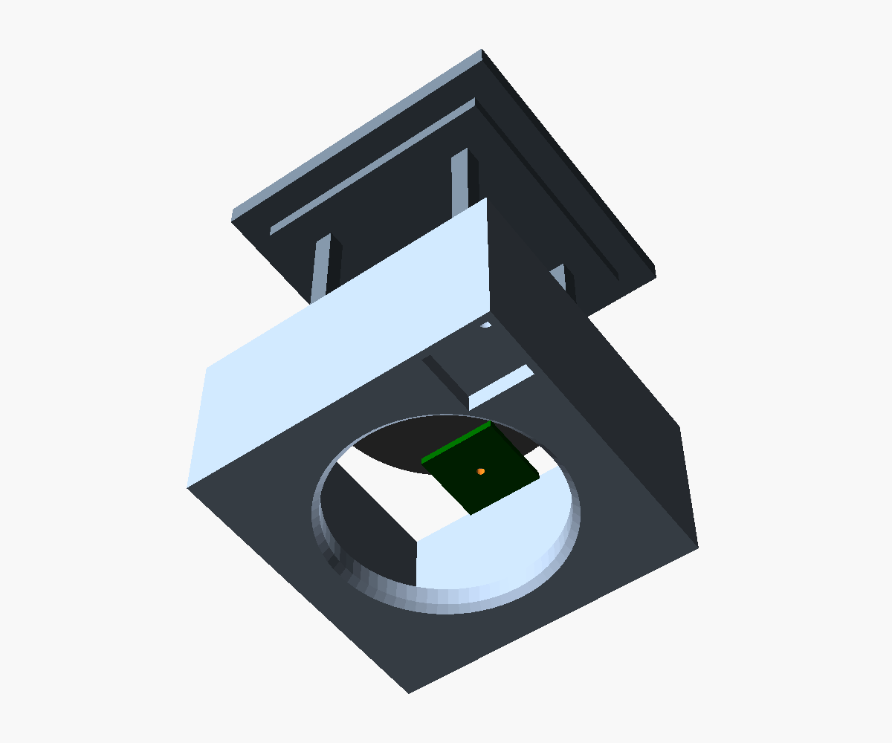
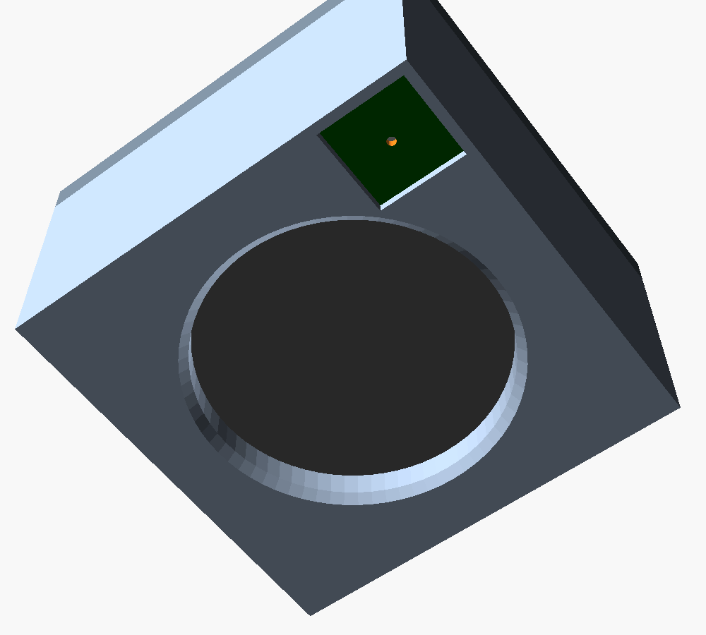
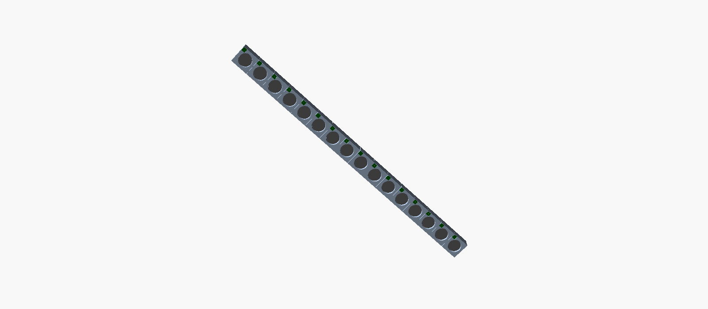
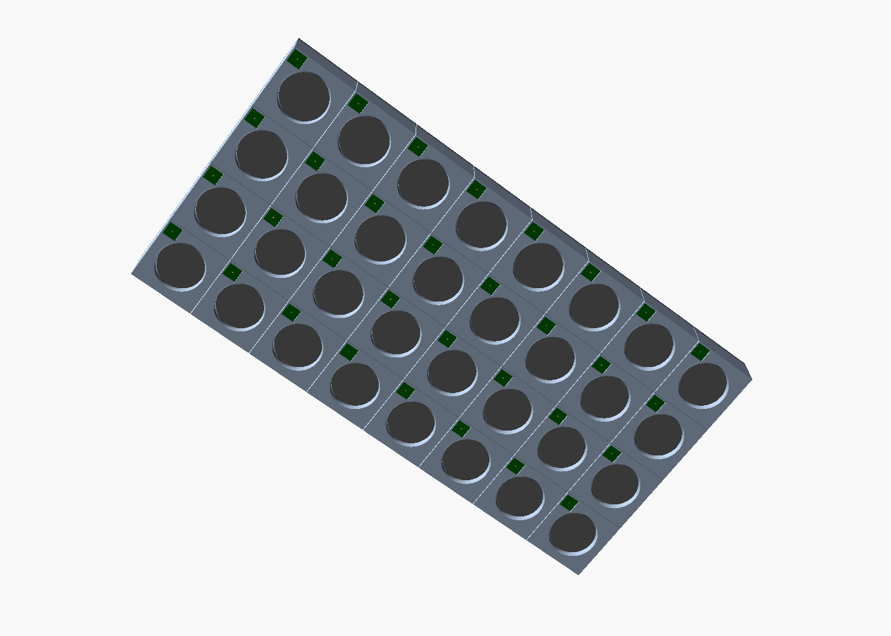

# Элемент решётки: динамик + микрофон в одном корпусе

## Выбор преобразователей

### Динамик

| | **Dayton Audio CE32A-8** (основной) | Visaton BF 32 S – 8 Ом (премиум) |
|---|---|---|
| Рама | круглая Ø32 мм, вырез Ø31.5 мм | квадратная 32 × 32 мм, 4 крепёжных отверстия |
| Монтажная глубина | 14.5 мм | 11 мм |
| Мощность | 2 Вт ном. / 4 Вт макс. | 2 Вт ном. / 5 Вт макс. |
| Диапазон | 240 Гц – 20 кГц | 150 Гц – 20 кГц |
| Чувствительность | 81 дБ @ 2.83 В/1 м (данные для версии 4 Ом) | ≈ 78 дБ @ 1 Вт/1 м |
| Цена | ≈ 5 $ | ≈ 15 $ (DigiKey) |

Почему **8 Ом**, а не 4: MAX98357A от 5 В отдаёт в 8 Ом не больше ≈ 1.8 Вт — меньше
номинала динамика. Даже при ошибке в программе (полная шкала) динамик не сгорит, а ток
от блока питания вдвое меньше. Громкости всё равно с запасом: рабочая полоса 2–4 кГц
лежит далеко выше резонанса обоих динамиков.

Visaton дороже, но у него квадратная рама с отверстиями (удобнее крепить) и, как
правило, меньший разброс между экземплярами. При бюджете 1000 $ основной выбор — Dayton;
держатель поддерживает оба (параметр `speaker`).

### Микрофон: TDK InvenSense ICS-43434

* цифровой I²S-выход 24 бита — внутри уже есть АЦП, децимация и антиалиасинг;
* чувствительность −26 дБПШ при 94 дБ SPL, отношение сигнал/шум 65 дБА,
  максимальный уровень 120 дБ SPL (не перегружается даже в 2 см от работающего динамика);
* корпус 3.5 × 2.65 × 0.98 мм, звуковое отверстие снизу (через печатную плату);
* выпускается сейчас и заменяет снятый с производства INMP441 (тот же протокол);
* есть на складе JLCPCB (C5656610, ≈ 3.8 $ от 10 шт.) — плату можно заказать собранной.

### Можно ли взять готовый «динамик + микрофон в одном корпусе»?

Готовых компонентов с доступом к обоим сигналам и нужными параметрами практически нет:
такие сборки делают под конкретные телефоны и гарнитуры. Поэтому **общий корпус делаем
сами** — это напечатанный на 3D-принтере держатель, который объединяет динамик и
микрофон в один элемент. По смыслу это и есть приёмопередающий модуль ЦАФАР.

Любопытный факт для экскурсии: динамик по принципу обратимости сам работает как
микрофон. Но у MAX98357A нет приёмного тракта, а отдельный MEMS-микрофон даёт намного
более чистый приём, поэтому в элементе стоят два преобразователя.

## Держатель («плитка» 40 × 40 мм)

Файл модели — [`hardware/mech/dpaa_element.scad`](../../hardware/mech/dpaa_element.scad)
(OpenSCAD, все размеры — параметры в начале файла). Готовые STL и контуры задней
панели — в `hardware/mech/stl/`.

| Разнесённый вид | Сборка |
|---|---|
|  |  |

Устройство:

* **Размер 39.6 × 39.6 мм = шаг решётки 40 мм.** Из одинаковых плиток собирается и
  линейка 16 × 1, и плоская решётка 8 × 4 или 8 × 8 — для сканирования в двух плоскостях
  менять держатель не придётся.
* **Лицевая часть** толщиной 5 мм: раскрыв Ø27.5 мм перед диффузором с фаской и
  гнездо 8.2 × 8.2 мм под микроплату микрофона в углу.
* **Закрытый объём за динамиком** (32.8 × 32.8 × 16 мм). Он гасит излучение назад
  (у решётки нет заднего лепестка) и акустически отделяет микрофон от тыла динамика.
* **Крышка** с пробкой, четырьмя упорами, которые прижимают раму динамика к лицевой
  части, двумя латунными закладными M3 для крепления к задней панели и пазом под
  плату усилителя. Отверстие для кабеля после монтажа заливается термоклеем.
* **Канал проводов микрофона** Ø2 мм идёт из гнезда микроплаты в объём за динамиком;
  провода выходят вместе с проводами динамика через отверстие в крышке.

Микрофон стоит на 14.8 мм правее и выше центра динамика (если смотреть сзади, по
направлению излучения). Для лучей в дальней зоне общий сдвиг всех микрофонов ничего не
меняет, а при фокусировке в ближней зоне он учитывается: `dpaa/hw.py`,
`MIC_OFFSET` и `mic_positions()`.

| Линейная решётка 16 × 1 | Плоская решётка 8 × 4 |
|---|---|
|  |  |

### Печать

| Деталь | Файл | Ориентация | ≈ Пластик |
|---|---|---|---|
| Держатель | `holder_round32.stl` / `holder_square32.stl` | лицом на стол | 8–10 г |
| Крышка | `back_round32.stl` / `back_square32.stl` | наружной стороной на стол | 5–6 г |

PETG или PLA, сопло 0.4 мм, слой 0.2 мм, 3–4 периметра, заполнение 30 %, без поддержек.
На 18 комплектов уходит ≈ 300 г пластика и 8–10 часов печати на одном принтере.
Сначала напечатайте 1–2 пробных держателя и проверьте посадку конкретных динамиков:
параметры `spk_rd`/`spk_sq`, `flange_t`, `spk_depth` подгоняются под образец.

### Сборка элемента

1. Вплавить паяльником две латунные закладные M3 × 4.5 в крышку.
2. Микроплату микрофона: припаять 5 проводов 30 AWG (3V3, GND, SCK, WS, SD), продеть
   их в канал, вклеить плату в гнездо (микрофоном внутрь) каплей силикона по краю.
   Звуковое отверстие не заливать!
3. Вложить динамик сзади, рамой к лицевой части (под раму — кольцо поролона 1 мм).
4. Вывести провода динамика и микрофона через отверстие крышки, вставить крышку,
   упоры прижмут динамик. Залить отверстие для кабеля термоклеем — объём должен быть
   герметичным.
5. Вставить плату усилителя в паз крышки и подключить провода.

### Задняя панель

Контуры для лазерной резки (фанера или акрил 4–5 мм): `panel_line.svg/.dxf` (16 × 1) и
`panel_planar.svg/.dxf` (8 × 4). Для каждого элемента в панели есть два отверстия M3
и окно под рёбра крышки, плату усилителя и кабель. Именно панель задаёт точный шаг
40 мм, от которого зависит качество луча, поэтому её лучше резать лазером, а не
сверлить вручную.
