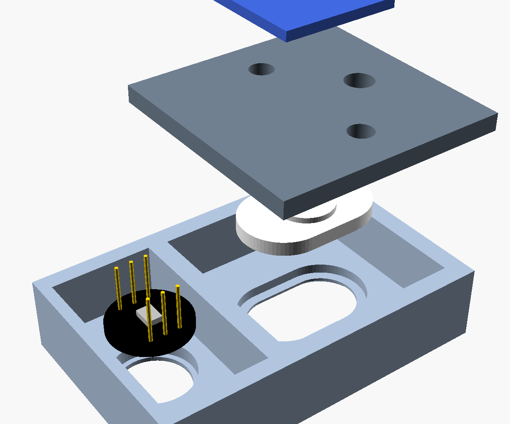
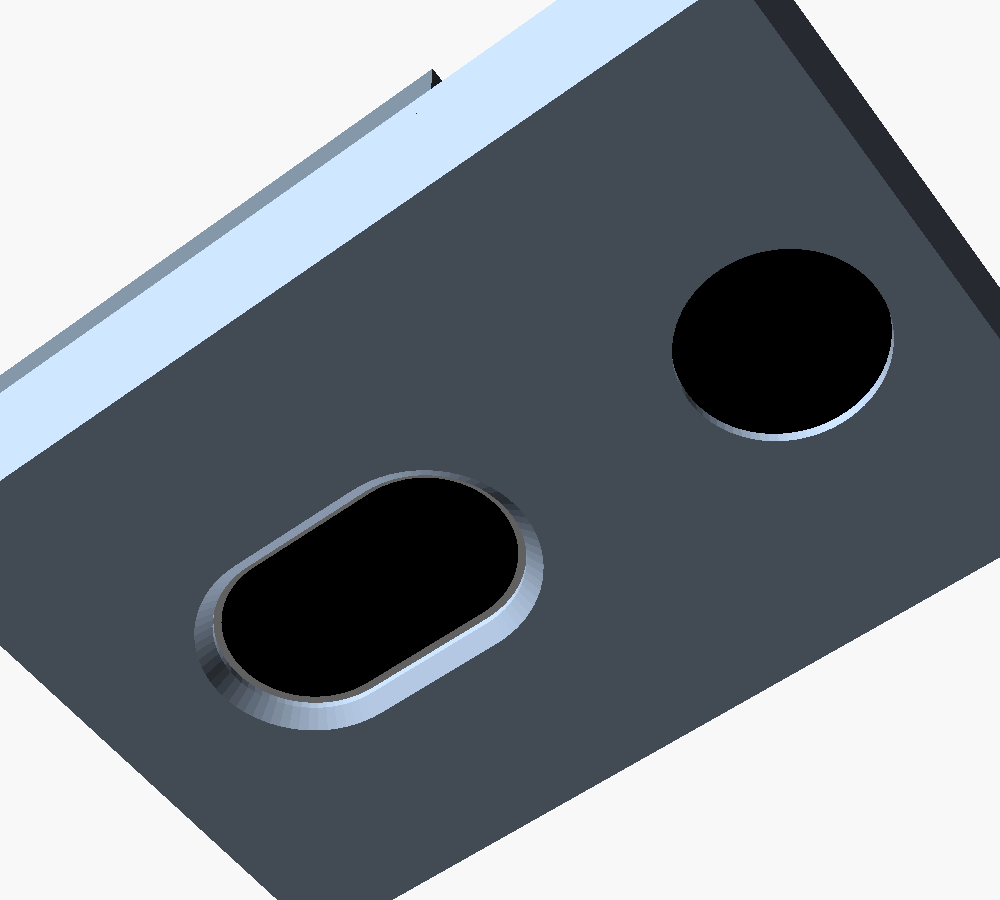
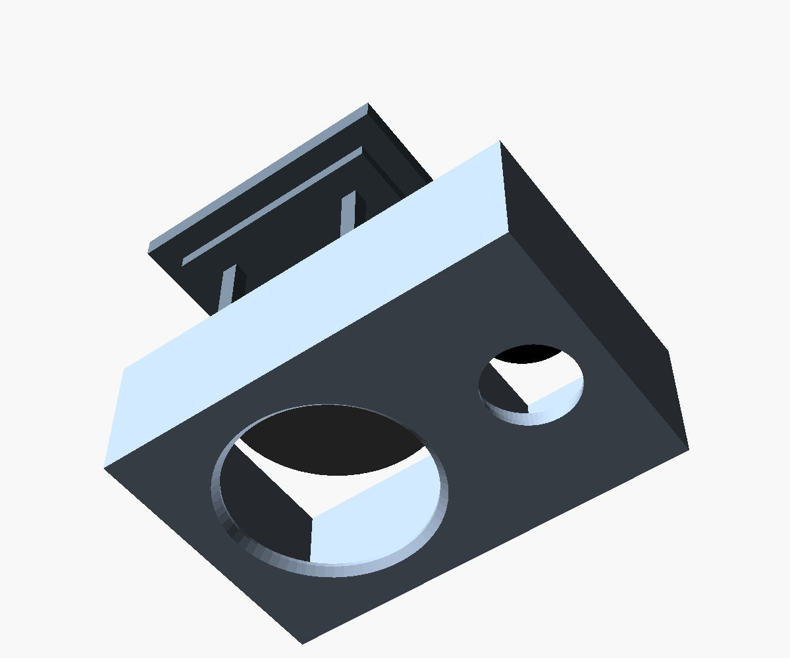
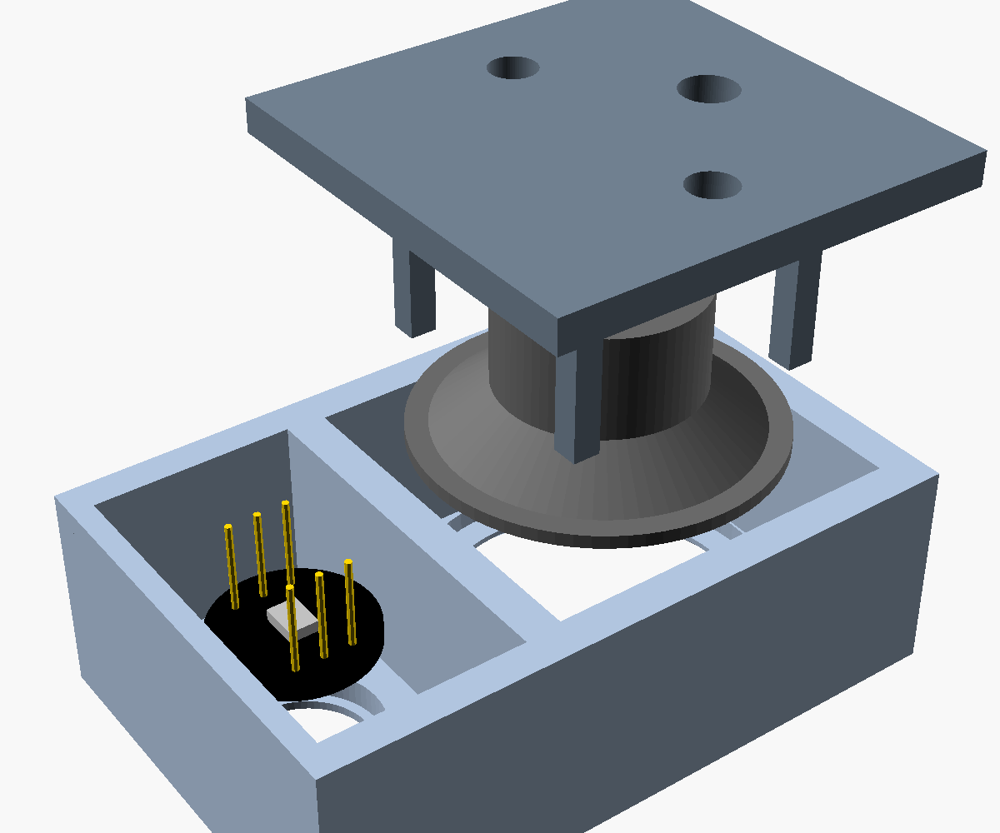
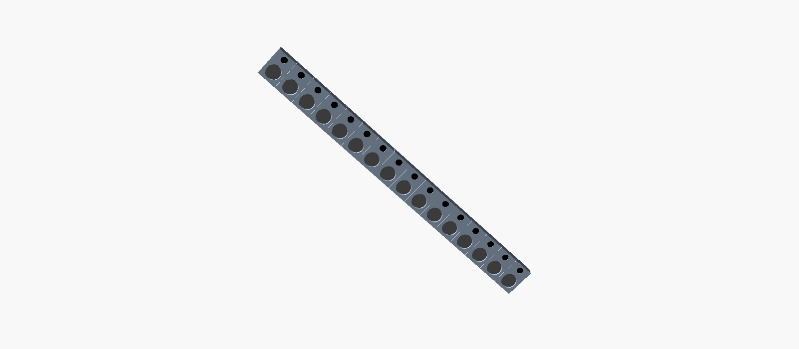
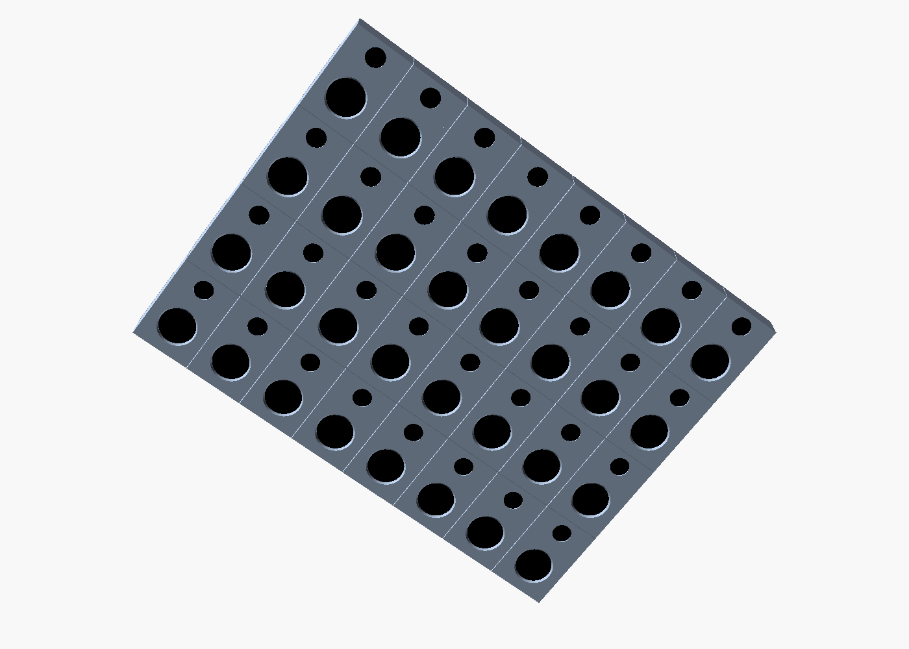

# Элемент решётки: динамик + микрофон в одном корпусе

## Выбор преобразователей

### Динамик: массовый круглый 28 мм, 8 Ом, 2 Вт

Точная модель не важна. В рабочей полосе 1.5–4.3 кГц любой исправный микродинамик
звучит ровно, а разницу между экземплярами убирает калибровка. Поэтому берём самый
распространённый и дешёвый вариант, одной партией и с запасом.

| Параметр держателя `speaker` | **`rd28`** (основной) | **`ov1524`** (равноценная замена) | `rd36` (самый дешёвый) | `rd32` | `sq32` |
|---|---|---|---|---|---|
| Что это | круглый 28 мм, 8 Ом, 2 Вт, внутренний магнит | овальный 15 × 24 мм, 8 Ом, 0.8 Вт (макс. 1 Вт), 500–10 000 Гц | круглый 36 мм майларовый, 8 Ом, 1 Вт | Dayton Audio CE32A-8 и аналоги | Visaton BF 32 S |
| Как искать | «28mm 8 ohm 2W speaker» (Gikfun AE1054, uxcell, HALJIA…) | «овальный динамик 8 Ом 1 Вт 15×24» | «36mm 8 ohm 1W mylar speaker» | — | — |
| Толщина | 5.5–10 мм | 3.5 мм | ≈ 5 мм | 14.5 мм | 11 мм |
| Цена | ≈ 0.5–3 $ | ≈ 0.5–2 $ | ≈ 0.3–1 $ | ≈ 5–20 $, часто нет в наличии | ≈ 15 $ |

Почему **8 Ом и не меньше 2 Вт**: MAX98357A от 5 В отдаёт в 8 Ом не больше ≈ 1.8 Вт.
Значит, даже при ошибке в программе (полная шкала) динамик не сгорит, а суммарный ток 16
усилителей укладывается в блок питания 5 В 6 А.

* Динамики **0.8–1 Вт** (`ov1524`, `rd36`) на полной шкале можно перегреть. `tools/dpaa_ctl.py` сам
  не даёт поднять уровень выше 0.5 шкалы (`MAX_AMP`), это не больше четверти мощности.
  Даже два луча сразу дают на элементе не больше половины шкалы (≈ 0.45 Вт).
  Опасна только ручная запись регистров в обход утилиты.
* Динамик **4 Ом 3 Вт** тоже безопасен для себя, но ток вдвое больше. На полной шкале
  всех 16 каналов блоку 6 А не хватит, поэтому такой вариант лучше не брать.

**Размеры в таблице — типовые.** Перед печатью измерьте свой динамик и, если нужно,
поправьте в `dpaa_element.scad` строку `spk_table`: диаметр рамы, монтажную глубину,
толщину обода и диаметр магнита. Раскрыв, гнездо, объём и упоры крышки пересчитаются сами.
Проверено, что влезает от 15 × 24 до 36 мм по диаметру и до 16 мм по глубине.

**Овальный `ov1524`** ставится длинной стороной вертикально: по ширине решётки он
занимает всего 15 мм. Форма на диаграмму не влияет — на 2–4 кГц длина волны 8–17 см,
намного больше динамика, и он излучает почти одинаково во все стороны. На нижнем краю
полосы (≈ 1.5 кГц) он тише 28-миллиметрового, для демонстрации это не критично.
Выводы у него всего 50 мм, поэтому объём за ним сделан мельче (10 мм вместо 16) — провода
дотягиваются через крышку и панель до колодки усилителя впритык. Если не хватит, нарастите
их двумя кусками провода с термоусадкой. Крышку прижимают четыре упора ближе к концам
овала: в середине у динамика магнит, внизу выходят провода.

| Овальный: разнесённый вид сзади | Овальный: вид спереди |
|---|---|
|  |  |

### Микрофон: TDK InvenSense ICS-43434

* цифровой I²S-выход 24 бита — внутри уже есть АЦП, децимация и антиалиасинг;
* чувствительность −26 дБПШ при 94 дБ SPL, отношение сигнал/шум 65 дБА,
  максимальный уровень 120 дБ SPL (не перегружается даже в 2 см от работающего динамика);
* корпус 3.5 × 2.65 × 0.98 мм, звуковое отверстие снизу (через печатную плату);
* выпускается сейчас и заменяет снятый с производства INMP441 (тот же протокол);
* продаётся **готовым круглым модулем** с гребёнкой из 6 выводов (VDD, GND, SCK, WS, SD,
  L/R) — своя плата для микрофона не нужна.

### Можно ли взять готовый «динамик + микрофон в одном корпусе»?

Готовых компонентов с доступом к обоим сигналам и нужными параметрами практически нет:
такие сборки делают под конкретные телефоны и гарнитуры. Поэтому **общий корпус делаем
сами** — это напечатанный на 3D-принтере держатель, который объединяет динамик и
микрофон в один элемент. По смыслу это и есть приёмопередающий модуль ЦАФАР.

Любопытный факт для экскурсии: динамик по принципу обратимости сам работает как
микрофон. Но у MAX98357A нет приёмного тракта, а отдельный MEMS-микрофон даёт намного
более чистый приём, поэтому в элементе стоят два преобразователя.

## Держатель («плитка» 40 × 60 мм) под готовые модули

Файл модели — [`hardware/mech/dpaa_element.scad`](../../hardware/mech/dpaa_element.scad)
(OpenSCAD, все размеры — параметры в начале файла). Готовые STL и контуры задней
панели — в `hardware/mech/stl/`, пересборка — `hardware/mech/build.sh`.

| Разнесённый вид | Сборка |
|---|---|
|  |  |

Устройство:

* **Плитка 39.6 × 59.6 мм** — шаг 40 мм по горизонтали (как у решётки), 60 мм по
  вертикали. Из одинаковых плиток собирается линейка 16 × 1; плоская решётка 8 × 4
  тоже возможна, но с вертикальным шагом 60 мм (дифракционные лепестки по углу места
  появятся раньше — примерно с 2.9 кГц при сканировании во всём секторе).
* **Внизу — динамик** в закрытом объёме ≈ 33 × 33 × 16 мм (для 36 мм — 37 × 37 × 16,
  для овального — 33 × 33 × 10): нет излучения
  назад, тыл динамика акустически отделён от микрофона. Раскрыв на 4.5 мм меньше рамы, с фаской.
* **Вверху — гнездо под готовый модуль ICS-43434**: сквозное отверстие Ø `mic_d`
  (по умолчанию 14.2 мм) с упорным бортиком спереди. Модуль вставляется сзади стороной
  со звуковым отверстием вперёд, выводы смотрят назад — к проводам Dupont. **Диаметр
  модуля продавцы не указывают: измерьте его и поправьте `mic_d`** (модуль + 0.2 мм).
* **Крышка** закрывает объём динамика: четыре упора прижимают обод рамы динамика, две
  латунные закладные M3 крепят плитку к задней панели, через отверстие выходят
  провода динамика (после монтажа — термоклей).
* **Модуль усилителя MAX98357A** крепится стяжкой к задней панели за динамиком — для
  него в панели есть прорези.

Микрофон стоит на 29.8 мм выше центра динамика. Для лучей в дальней зоне общий сдвиг
всех микрофонов ничего не меняет, а при фокусировке в ближней зоне он учитывается:
`dpaa/hw.py`, `MIC_OFFSET` и `mic_positions()`.

| Линейная решётка 16 × 1 | Плоская решётка 8 × 4 |
|---|---|
|  |  |

### Печать

| Деталь | Файл | Ориентация | ≈ Пластик |
|---|---|---|---|
| Держатель | `holder_rd28.stl` (или `_ov1524`, `_rd36`, `_rd32`, `_sq32`) | лицом на стол | 12–15 г |
| Крышка | `back_rd28.stl` (или `_ov1524`, `_rd36`, `_rd32`, `_sq32`) | наружной стороной на стол | 5–6 г |

PETG или PLA, сопло 0.4 мм, слой 0.2 мм, 3–4 периметра, заполнение 30 %, без поддержек.
На 18 комплектов уходит ≈ 350 г пластика. Сначала напечатайте 1–2 пробных держателя и
проверьте посадку динамика и модуля микрофона. Для `rd36` стенки корпуса
тоньше (≈ 1.4 мм) — печатайте с 3 периметрами и без усадки (PETG).

### Сборка элемента (без пайки, если гребёнки модулей запаяны)

1. Вплавить паяльником две латунные закладные M3 × 4.5 в крышку.
2. Вставить модуль микрофона в верхнее гнездо сзади, звуковым отверстием вперёд;
   закрепить каплей термоклея по краю (отверстие не заливать).
3. Вложить динамик сзади, рамой к лицевой части (под раму — кольцо поролона 1 мм);
   вывести его провода через отверстие крышки, вставить крышку, залить отверстие термоклеем.
4. Прикрутить плитку к задней панели двумя винтами M3 × 8; модуль усилителя
   притянуть стяжкой к панели за динамиком, провода динамика — в колодку модуля.
5. Подключить провода Dupont: 5 — к усилителю, 6 — к микрофону (по надписям на модулях,
   раскладка — [pinout.md](pinout.md)).

### Задняя панель

Контуры для лазерной резки (фанера или акрил 4–5 мм): `panel_line.svg/.dxf` (16 × 1) и
`panel_planar.svg/.dxf` (8 × 4). Для каждого элемента: два отверстия M3, отверстие для
проводов динамика, окно к выводам микрофона и две прорези под стяжку модуля усилителя.
Именно панель задаёт точный шаг 40 мм, от которого зависит качество луча, поэтому её
лучше резать лазером.
