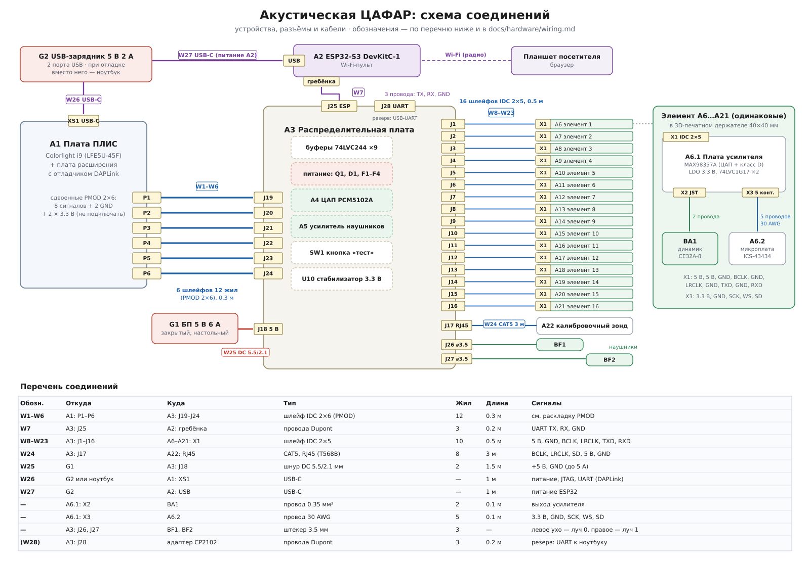

# Схема соединений

Уровень устройств: какие платы и модули есть в установке, какими разъёмами они
соединяются и какими кабелями. Внутреннее устройство плат — в [schematics.md](schematics.md),
функциональная (структурная) схема — в [architecture.md](architecture.md).

Исходник рисунка — `scripts/draw_wiring_diagram.py` (PNG для печати: `docs/img/wiring.png`).

## Перечень устройств

| Поз. | Наименование | Кол-во | Разъёмы |
|---|---|---|---|
| A1 | Плата ПЛИС: Colorlight i9 (LFE5U-45F) + плата расширения с DAPLink | 1 | XS1 USB-C; P1–P6 — сдвоенные PMOD 2×6 |
| A2 | ESP32-S3 DevKitC-1 (Wi‑Fi-пульт) | 1 | USB-C; штыревая гребёнка |
| A3 | Распределительная плата | 1 | J1–J16 IDC 2×5 (элементы); J17 RJ45 (зонд); J18 питание 5 В; J19–J24 PMOD 2×6 (к A1); J25 3 конт. (ESP32); J26, J27 гнёзда 3.5 мм (наушники); J28 3 конт. (резервный UART) |
| A4 | Модуль ЦАП PCM5102A (на A3) | 1 | — |
| A5 | Модуль усилителя для наушников (на A3) | 1 | — |
| A6–A21 | Элемент решётки № 1–16 | 16 | X1 IDC 2×5 |
| A6.1 … | Плата усилителя элемента (MAX98357A) | 16 | X1 IDC 2×5; X2 JST-XH 2 конт.; X3 5 конт. |
| A6.2 … | Микроплата микрофона ICS-43434 | 16 | 5 площадок под провода |
| BA1 … | Динамик Dayton Audio CE32A-8 | 16 | 2 лепестка |
| A22 | Калибровочный зонд (ICS-43434) | 1 | XS1 RJ45 |
| G1 | Блок питания 5 В 6 А | 1 | штекер 5.5/2.1 мм |
| G2 | USB-зарядник 5 В 2 А, 2 порта (при отладке — ноутбук) | 1 | USB-A / USB-C |
| BF1, BF2 | Наушники | 2 | штекер 3.5 мм |

## Перечень кабелей

| Обозн. | Откуда | Куда | Тип | Жил | Длина | Сигналы |
|---|---|---|---|---|---|---|
| W1–W6 | A1: P1–P6 | A3: J19–J24 | шлейф IDC 2×6, прямой (контакт n → n) | 12 | 0.3 м | раскладка ниже |
| W7 | A3: J25 | A2: гребёнка | провода Dupont | 3 | 0.2 м | UART TX, RX, GND |
| W8–W23 | A3: J1–J16 | A6–A21: X1 | шлейф IDC 2×5 | 10 | 0.5 м | 5 В, GND, BCLK, LRCLK, TXD, RXD |
| W24 | A3: J17 | A22: XS1 | CAT5, RJ45 (T568B) | 8 | 3 м | BCLK, LRCLK, SD, 5 В, GND |
| W25 | G1 | A3: J18 | шнур DC 5.5/2.1 мм | 2 | 1.5 м | +5 В, GND (до 5 А) |
| W26 | G2 или ноутбук | A1: XS1 | USB-C | — | 1 м | питание A1; JTAG и UART через DAPLink |
| W27 | G2 | A2: USB | USB-C | — | 1 м | питание A2 |
| — | A6.1: X2 | BA1 | провод 0.35 мм² | 2 | 0.1 м | выход усилителя |
| — | A6.1: X3 | A6.2 | провод 30 AWG | 5 | 0.1 м | 3.3 В, GND, SCK, WS, SD |
| — | A3: J26, J27 | BF1, BF2 | штекер 3.5 мм | 3 | — | левое ухо — луч приёма 0, правое — луч 1 |
| (W28) | A3: J28 | адаптер CP2102 | провода Dupont | 3 | 0.2 м | резерв: UART к ноутбуку, если UART DAPLink не выведен на ПЛИС |

## Раскладка сигналов по кабелям W1–W6 (PMOD 2×6)

Нумерация контактов — как у PMOD: 1–6 верхний ряд, 7–12 нижний; 5 и 11 — GND,
6 и 12 — 3.3 В. **Контакты 3.3 В на распределительной плате не подключаются**: у A3 свой
стабилизатор U10, а земли соединяются все. Направление указано относительно ПЛИС.

| Кабель | A1 → A3 | 1 | 2 | 3 | 4 | 7 | 8 | 9 | 10 |
|---|---|---|---|---|---|---|---|---|---|
| W1 | P1 → J19 | BCLK → | LRCLK → | MON_SD → | ← BTN_TEST | ESP_TX → | ← ESP_RX | USB_TX → | ← USB_RX |
| W2 | P2 → J20 | TXD0 → | TXD1 → | TXD2 → | TXD3 → | TXD4 → | TXD5 → | TXD6 → | TXD7 → |
| W3 | P3 → J21 | TXD8 → | TXD9 → | TXD10 → | TXD11 → | TXD12 → | TXD13 → | TXD14 → | TXD15 → |
| W4 | P4 → J22 | ← MIC0 | ← MIC1 | ← MIC2 | ← MIC3 | ← MIC4 | ← MIC5 | ← MIC6 | ← MIC7 |
| W5 | P5 → J23 | ← MIC8 | ← MIC9 | ← MIC10 | ← MIC11 | ← MIC12 | ← MIC13 | ← MIC14 | ← MIC15 |
| W6 | P6 → J24 | ← CAL | резерв | резерв | резерв | резерв | резерв | резерв | резерв |

Резерв на P6 (7 линий) и свободные PMOD платы расширения пригодятся при переходе на
плоскую решётку 8 × 4.

На распределительной плате: BCLK, LRCLK, TXD — на входы буферов 74LVC244 (U1–U6);
MIC0–15 — с выходов буферов U7, U8 через 33 Ом; MON_SD — на ЦАП A4 через U9;
CAL — с разъёма J17 через U9; ESP_TX/ESP_RX — на J25 через 100 Ом; USB_TX/USB_RX — на J28
через 100 Ом; BTN_TEST — кнопка SW1 на 3.3 В (подтяжка к земле включена в ПЛИС).

## Разъёмы распределительной платы для вспомогательных кабелей

| Разъём | Контакт | Сигнал | Примечание |
|---|---|---|---|
| J25 (к ESP32) | 1 | ESP_TX (ПЛИС → ESP32 RX) | на ESP32 — вывод RX UART1, например GPIO18; задаётся в прошивке пульта |
| | 2 | ESP_RX (ESP32 TX → ПЛИС) | на ESP32 — вывод TX UART1, например GPIO17 |
| | 3 | GND | |
| J28 (резерв) | 1 | USB_TX (ПЛИС → RX адаптера) | адаптер CP2102/CH340 на 3.3 В |
| | 2 | USB_RX (TX адаптера → ПЛИС) | |
| | 3 | GND | |
| J18 | +, − | +5 В, GND | гнездо 5.5/2.1 мм, центр — «+» |

Раскладка шлейфов W8–W23 (IDC 2×5) и кабеля зонда W24 (RJ45) — в [pinout.md](pinout.md).

## Порядок подключения

1. Всё собрать и соединить **при выключенном питании**; ключи всех разъёмов IDC —
   в одну сторону.
2. Включить G2 (плата ПЛИС и ESP32), загрузить прошивку ПЛИС (`make prog`),
   проверить `dpaa_ctl.py id`.
3. Только после этого включить G1 (питание элементов). Выключать в обратном порядке.
