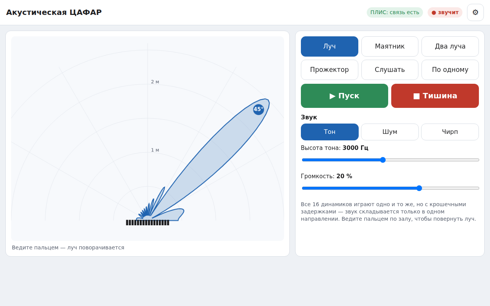
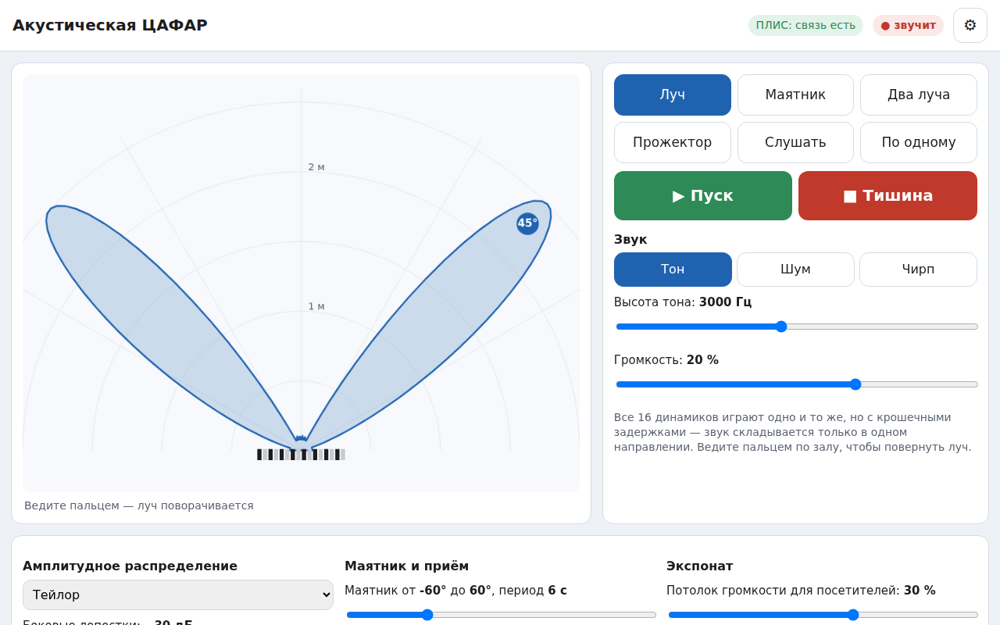

# Прошивка Wi-Fi-пульта (ESP32-S3-DevKitC-1)

ESP32 раздаёт свою сеть Wi-Fi, показывает посетителям страницу управления на планшете и
передаёт команды в ПЛИС по UART. Ноутбук для работы экспоната не нужен.

```
планшет ── Wi-Fi «DPAA» ──> ESP32-S3: страница + логика пульта ── UART1, 1 Мбит/с ──> ПЛИС
```



## Что умеет

* **Шесть сценариев** для посетителей:
  * **Луч** — ведёшь пальцем по плану зала, и луч поворачивается;
  * **Маятник** — сканирование;
  * **Два луча** — синий и красный, оба перетаскиваются;
  * **Прожектор** — коснись точки, и звук сфокусируется в ней;
  * **Слушать** — два луча приёма в наушники;
  * **По одному** — проверка элементов.
* **Звук:** тон (высота регулируется), полосовой шум или ЛЧМ-пачки («чирп»).
* **Тишина** — большая красная кнопка. После включения питания решётка молчит.
* **Автопилот для музея.** Если экспонатом не пользуются 90 с, решётка сама показывает
  четыре номера по 15 с: маятник тоном, два луча, «гуляющий» прожектор, маятник шумом.
  Громкость автопилота не выше 20 %. Первое касание экрана возвращает управление
  посетителю. Поэлементный тест и приём автопилот не прерывает.
* **Служебная панель** (кнопка ⚙):
  * амплитудное распределение: Тейлор, Чебышёв, Ханн, отключение элементов, свои веса;
  * диапазон и период маятника;
  * потолок громкости для посетителей (по умолчанию 30 %, максимум 50 %);
  * автопилот: включение и задержка;
  * уровни 16 микрофонов и зонда.
* Настройки хранятся в энергонезависимой памяти и переживают выключение.



На странице рисуется лепесток звука. Задержки при этом квантуются до 1/32 отсчёта, как в
регистрах ПЛИС, а веса берутся фактические — их присылает ESP32.

## Подключение

К разъёму J25 распределительной платы (см. [wiring.md](../../docs/hardware/wiring.md)) тремя
проводами Dupont:

| ESP32-S3-DevKitC-1 | J25 | ПЛИС |
|---|---|---|
| GPIO17 (TX UART1) | 2 | `esp_rx` |
| GPIO18 (RX UART1) | 1 | `esp_tx` |
| GND | 3 | земля |

Питание ESP32 — от USB-зарядника G2 (разъём «UART» или «USB» на плате).

## Сборка и прошивка

Нужен [PlatformIO](https://platformio.org/): расширение для VS Code или командная строка
(`pip install platformio`). Внешних библиотек нет — только то, что входит в Arduino-ESP32.

```bash
cd firmware/esp32
pio run                  # сборка (страница web/index.html упаковывается в прошивку сама)
pio run -t upload        # прошивка: кабель USB в разъём «UART» платы
pio device monitor       # журнал, 115200 бод
```

Готовые файлы прошивки собирает GitHub Actions: артефакт `dpaa-esp32-firmware` в задаче
**CI → «Прошивка ESP32-S3»**. Их можно записать без PlatformIO:

```bash
esptool.py --chip esp32s3 erase_flash
esptool.py --chip esp32s3 write_flash 0x0 bootloader.bin 0x8000 partitions.bin 0x10000 firmware.bin
```

## Первое включение

1. Включить ESP32 и подключить планшет к сети **`DPAA`**, пароль **`dpaa2026`**.
2. Страница пульта откроется сама. Если не открылась — адрес `http://192.168.4.1/`
   или `http://dpaa.local/`.
3. Индикатор «ПЛИС: связь есть» — ПЛИС прошита и UART подключён верно.
4. Сменить имя и пароль сети: `http://192.168.4.1/api/wifi?ssid=Имя&pass=НовыйПароль`
   (пароль от 8 символов), после этого ESP32 перезагрузится.

Ноутбук с `tools/dpaa_ctl.py` или C#-пультом можно подключать одновременно: у ПЛИС два
порта команд, а ESP32 сам отбрасывает ответы, адресованные ноутбуку.

## Устройство

```
firmware/esp32/
├── platformio.ini
├── src/main.cpp             — «железо»: UART1, Wi-Fi, веб-сервер, DNS, настройки во флеше
├── src/web_page.h           — страница в gzip (генерируется tools/embed_web.py)
├── web/index.html           — страница пульта (HTML + JS, без внешних файлов)
├── lib/dpaa/src/
│   ├── dpaa_core.*          — протокол, регистры, окна, лучи, сценарии (перенос dpaa/hw.py и dpaa_ctl.py)
│   └── controller.*         — веб-API, маятник, поэлементный тест, автопилот, опрос уровней
├── tools/embed_web.py
└── test/
    ├── host/dpaa_host.cpp   — та же логика на компьютере + симулятор ПЛИС
    ├── web_mock.py          — «ESP32 на компьютере»: страница + логика + симулятор
    └── stubs/               — заглушки Arduino для проверки компиляции main.cpp
```

### Веб-API

Запросы GET, ответ — JSON состояния (режим, параметры, связь с ПЛИС, уровни микрофонов):

| Запрос | Что делает |
|---|---|
| `/api/state` | только состояние |
| `/api/set?mode=beam&az=30&run=1` | сменить параметры. `mode`: `beam`, `sweep`, `focus`, `two`, `listen`, `elements`; `run=1` — пуск, `run=0` — тишина |
| `/api/stop` | тишина |
| `/api/wifi?ssid=…&pass=…` | имя и пароль сети, затем перезагрузка |

Параметры `/api/set`:

| Группа | Параметры |
|---|---|
| сигнал | `src` (0 — тон, 1 — шум, 2 — ЛЧМ), `tone`, `amp` |
| луч | `az` |
| маятник | `sf`, `st`, `sp` |
| прожектор | `fx`, `fy` |
| два луча | `az1`, `az2`, `t1`, `s2`, `t2` |
| приём | `left`, `right` |
| по одному | `et`, `dw` |
| распределение | `taper` (0–3), `sll`, `off` (маска выключенных элементов), `cw`, `w` (16 весов) |
| экспонат | `maxamp`, `demo`, `idle` |

### Проверка без ESP32

```bash
python -m pytest tests/test_esp32.py tests/test_esp32_web.py
python firmware/esp32/test/web_mock.py      # пульт в браузере компьютера: http://localhost:8080/
```

* **Кадры для ПЛИС** сверяются с Python-моделью бит в бит: эталоны `golden.json` (общие с C#-пультом)
  и 300 случайных конфигураций лучей, фокуса и приёма с разными распределениями.
* **Контроллер** проверяется отдельно:
  * живое обновление не чаще 25 раз в секунду;
  * маятник обновляется 50 раз в секунду;
  * обход элементов;
  * автопилот включается через заданное время, и касание экрана возвращает управление;
  * ограничение громкости и сообщения об ошибках.
* **Страница** открывается в Chromium (Playwright), где нажимаются кнопки и «водится пальцем».
  Проверяется, что кадры действительно уходят в симулятор ПЛИС.
