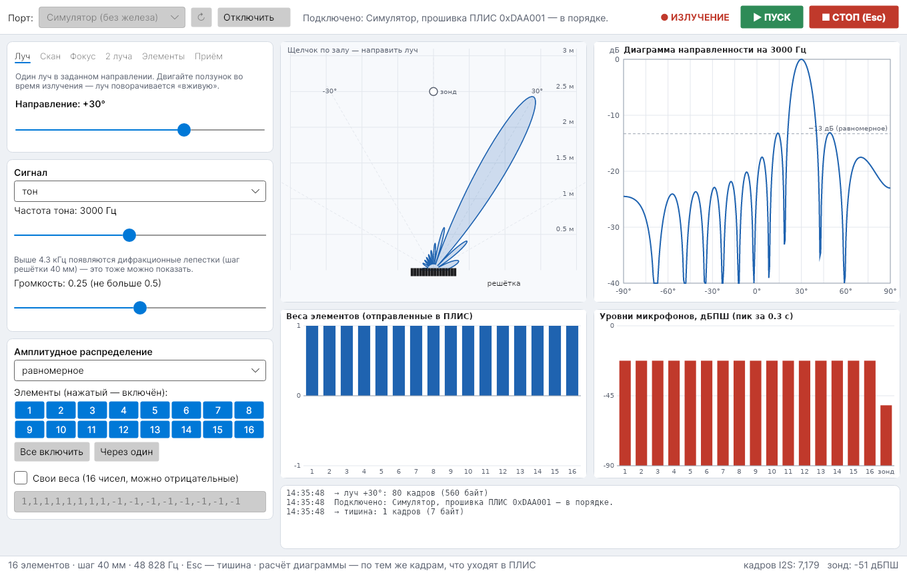
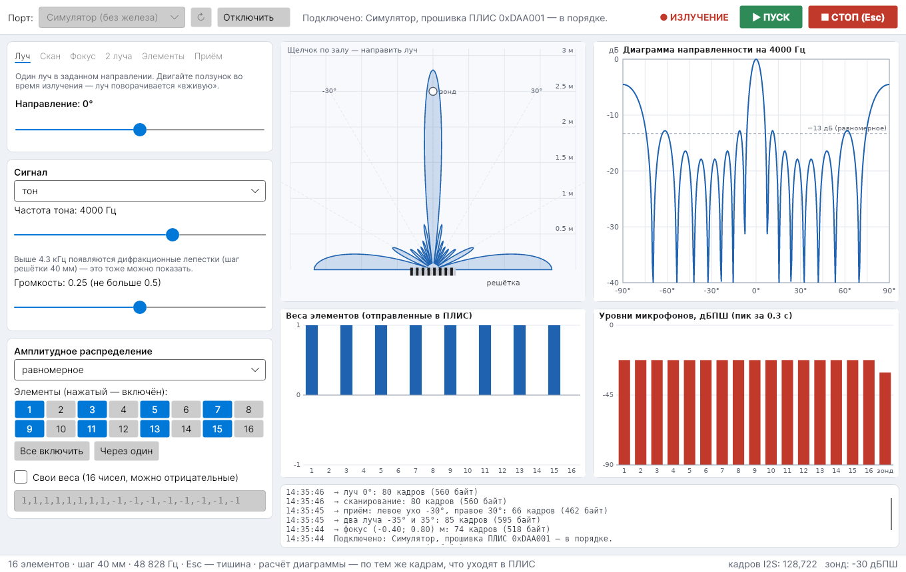

# DpaaControl — пульт управления акустической ЦАФАР (C#)

Настольное приложение для ноутбука: подключается к плате ПЛИС по USB-UART (1 Мбит/с)
и управляет решёткой. Работает на Windows 10/11, Linux и macOS (.NET 8 + Avalonia).
Без железа можно работать с **симулятором** — он отвечает как ПЛИС и изображает уровни
микрофонов, так что демонстрацию можно отрепетировать заранее.



## Что умеет

| Вкладка | Что происходит | Аналог в `tools/dpaa_ctl.py` |
|---|---|---|
| **Луч** | луч в заданном направлении; ползунок или щелчок по плану зала поворачивает его «вживую» | `beam` |
| **Скан** | луч качается маятником между двумя углами | `sweep` |
| **Фокус** | фокусировка в точку ближней зоны (щелчок по плану) | `focus` |
| **2 луча** | два независимых луча с разными сигналами | `two-beams` |
| **Элементы** | элементы звучат по очереди — проверка монтажа | `elements` |
| **Приём** | два луча приёма в наушники: левое и правое ухо | `listen` |

Для всех вкладок, кроме «Элементов»:

* **сигнал**: тон 500–6000 Гц, полосовой шум 1.5–4.3 кГц или ЛЧМ-пачки 2→4 кГц;
  громкость ограничена половиной шкалы (как в `dpaa_ctl.py`);
* **амплитудное распределение**: равномерное, Тейлор, Чебышёв, Ханн с заданным уровнем
  боковых лепестков; выключение отдельных элементов (например, «через один» — появляются
  дифракционные лепестки); свои веса, в том числе отрицательные (разностная диаграмма).

Справа — план зала сверху с «лепестком» звука, диаграмма направленности в дБ, веса
элементов и уровни 16 микрофонов и калибровочного зонда (опрос каждые 0.3 с).
**Диаграмма считается по тем же кадрам, что уходят в ПЛИС**: по квантованным регистрам
задержки (шаг 1/32 отсчёта) и веса — на экране ровно то, что излучит установка.

Клавиша **Esc** или кнопка «СТОП» — тишина. При закрытии окна установка тоже замолкает.



## Сборка и запуск

Нужен [.NET SDK 8](https://dotnet.microsoft.com/download) или новее (Visual Studio 2022/2026,
Rider или просто командная строка).

```bash
cd software/DpaaControl
dotnet run --project src/Dpaa.App          # запуск
dotnet test                                # тесты (25 шт.)
```

Один `.exe` для ноутбука экспоната (устанавливать .NET на нём не нужно):

```bash
dotnet publish src/Dpaa.App -c Release -r win-x64 --self-contained \
    -p:PublishSingleFile=true -p:IncludeNativeLibrariesForSelfExtract=true -o publish
```

Получится `publish/DpaaControl.exe` (≈ 90 МБ). Для Linux — `-r linux-x64`, для Mac —
`-r osx-arm64`. В Linux пользователю нужен доступ к порту: `sudo usermod -aG dialout $USER`.

Порт: в Windows — `COM…` отладчика DAPLink или адаптера CP2102/CH340 (см.
[pinout.md](../../docs/hardware/pinout.md)); в списке первым идёт «Симулятор (без железа)».

## Устройство

```
DpaaControl.sln
├── src/Dpaa.Core        — без интерфейса, можно использовать отдельно
│   ├── Hw.cs            — константы и карта регистров (как dpaa/hw.py)
│   ├── Protocol.cs      — кадры UART: A5 A1 A0 D2 D1 D0 CHK, ответ 5A …
│   ├── Fixed.cs         — форматы регистров: задержка, вес Q2.16, частота, биквад
│   ├── Geometry.cs      — положения динамиков и микрофонов, задержки луча и фокуса
│   ├── Tapers.cs        — окна Тейлора, Чебышёва, Ханна; Distribution (--taper/--off/--weights)
│   ├── Commands.cs      — таблицы лучей и генераторы (tx/rx_beam_commands, gen_commands)
│   ├── Scenarios.cs     — сценарии, кадр в кадр как у tools/dpaa_ctl.py
│   ├── RegisterFile.cs  — образ регистров из отправленных кадров
│   ├── Pattern.cs       — диаграмма направленности по регистрам (дальняя и ближняя зона)
│   └── Links.cs         — SerialLink (порт), SimulatedLink (симулятор)
├── src/Dpaa.App         — окно на Avalonia (MainWindow, MainViewModel, Controls/)
└── tests
    ├── Dpaa.Core.Tests  — сверка с Python бит в бит (golden.json) + физика
    └── Dpaa.App.Tests   — окно без экрана: сценарии на симуляторе, снимки окна
```

**Совместимость с прошивкой.** `golden.json` посчитан Python-моделью
(`python scripts/make_csharp_golden.py`) — той же, с которой сверяется RTL ПЛИС. Тесты
требуют совпадения кадров байт в байт: протокол, приращения фазы, коэффициенты фильтра шума,
окна, задержки лучей и фокуса, генераторы и все сценарии `dpaa_ctl.py`. Если меняется
`dpaa/hw.py` или прошивка, перегенерируйте эталоны и прогоните `dotnet test`.
